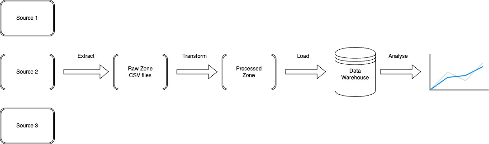

# Data Pipeline (ETL/ELT)

## 🎯 Goal

This project is a hands-on implementation of a **scalable data pipeline** inspired by how companies like Robinhood handle large volumes of data.  
The goal is to build end-to-end **ETL workflows** that:

- **Extract** data from external APIs (e.g., stock market data)
- **Transform** and clean the data
- **Load** it into a data lake or warehouse for analysis
- Orchestrate workflows using **Apache Airflow** for scheduling and monitoring

This project serves as a portfolio-ready showcase of **data engineering skills**, demonstrating the ability to build production-grade pipelines using industry-standard tools.

---

## 🛠️ Tech Stack

- **Apache Airflow (2.10.2)** – DAG scheduling & orchestration
- **Docker & Docker Compose** – Containerized, reproducible setup
- **PostgreSQL** – Airflow metadata database
- **Celery + Redis** – Distributed task execution
- **Pandas + yfinance** – Data extraction & transformation
- **Python 3.10+** – DAG scripting & pipeline logic

---

## 📂 Project Structure

```
Data-Pipeline/
├─ airflow-docker/
│ ├─ dags/ # DAGs (e.g., fetch_stock.py)
│ ├─ logs/ # Task logs
│ ├─ plugins/ # Custom operators/hooks (future)
│ └─ config/airflow.cfg # Airflow configuration
├─ data/ # Output data (mounted from container)
├─ requirements.txt # Python dependencies
├─ docker-compose.yaml # Container orchestration
└─ Dockerfile # Custom Airflow image
```

---

## 🚀 Current Progress

- ✅ **Set up Airflow with Docker** using CeleryExecutor
- ✅ **Configured DAG folder, logs, and plugins**
- ✅ **Created a sample DAG (`fetch_stock_example`)** that fetches AAPL stock prices from Yahoo Finance and stores them as CSV
- ✅ **Mounted local `data/` folder** for easy inspection of output
- ⏳ Next: Add data transformations and load step (Postgres/S3/Parquet)

---

## 🧭 Roadmap

- [ ] Add support for multiple symbols (parameterized DAGs)
- [ ] Transform data (add moving averages, daily returns)
- [ ] Load data into Postgres or a data lake
- [ ] Add Airflow sensors & alerts
- [ ] Deploy pipeline to cloud (optional)

---

## 🖥️ Getting Started

1. **Clone Repo & Install Docker**
2. **Build & Start Airflow**
   ```bash
   docker compose build
   docker compose up -d
   ```
3. **Open Airflow UI**

- Navigate to http://localhost:8080
- Enable and trigger fetch_stock_example

4. **Check Output**

- Look in ./data/AAPL.csv for results

---

## 📊 Project Architecture



The diagram above shows how data flows from the source API to the final warehouse.

### 🧠 How the Architecture Works

1. **Extract:** The pipeline calls the Yahoo Finance API to pull raw stock price data.
2. **Raw Zone:** The unprocessed data is saved as CSV files in `data/raw/`. This acts as a “data lake” where nothing is changed, so we always have the original source.
3. **Transform:** A PySpark job will clean the data, remove duplicates, and calculate new fields (daily return, moving averages). Clean data is saved into `data/processed/`.
4. **Load:** The processed data is written to a PostgreSQL table (or Parquet files in `data/warehouse/`) so analysts and dashboards can query it efficiently.
5. **Orchestration:** Airflow schedules, monitors, and retries each step automatically.
6. **Consumption:** Analysts, dashboards, or ML models can now use the clean data confidently.

## 🗄️ Data Model


The schema defines consistent column names and data types for stock data.
