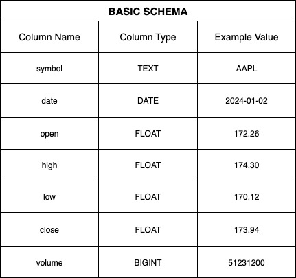

# Data Pipeline (ETL/ELT)

## 🎯 Goal

This project is a hands-on implementation of a **scalable data pipeline** inspired by how companies like Robinhood handle large volumes of data.  
The goal is to build end-to-end **ETL workflows** that:

- **Extract** data from external APIs (e.g., stock market data)
- **Transform** and clean the data
- **Load** it into a data lake or warehouse for analysis
- Orchestrate workflows using **Apache Airflow** for scheduling and monitoring

This project serves as a portfolio-ready showcase of **data engineering skills**, demonstrating the ability to build production-grade pipelines using industry-standard tools.

---

## 🛠️ Tech Stack

- **Apache Airflow (3.0.6)** – DAG scheduling & orchestration  
- **Docker & Docker Compose** – Fully containerized setup  
- **PostgreSQL + psycopg2 / SQLAlchemy** – Data storage  
- **Celery + Redis** – Distributed task execution  
- **PySpark** – Distributed data transformations (moving averages, returns)  
- **Pandas** – Lightweight operations & data loading  
- **Python 3.12** – Core programming language  

---

## 📂 Project Structure

```
Data-Pipeline/
├─ airflow-docker/
│ ├─ dags/ # DAGs (e.g., fetch_stock.py)
│ ├─ logs/ # Task logs
│ ├─ plugins/ # Custom operators/hooks (future)
│ └─ config/airflow.cfg # Airflow configuration
├─ data/ 
│ ├─ raw/ # Raw CSV files (one per symbol)
│ └─ processes # Partitioned parquet files (per symbol, year, month)
├─ scripts/ 
│ └─ transform_spark.py # PySpark transformation logic
├─ requirements.txt # Python dependencies
├─ docker-compose.yaml # Container orchestration
└─ Dockerfile # Custom Airflow image
```

---

## 🚀 Current Progress

✅ **Infrastructure & Orchestration**  
- Set up Airflow with CeleryExecutor in Docker Compose (Postgres + Redis)  
- Added `airflow-init` step to automatically migrate DB & create admin user  
- Configured DAGs folder, logs, and mounted data directories  

✅ **Extraction (E)**  
- Created `fetch_stock_dag.py` to fetch data for **multiple symbols** (AAPL, MSFT, TSLA)  
- Saved raw CSVs into `data/raw/`  

✅ **Transformation (T)**  
- Built `transform_spark.py` (PySpark job) to:  
  - Read multiple CSVs dynamically  
  - Extract ticker from second row  
  - Clean and normalize data (drop headers, cast data types)  
  - Deduplicate by (symbol, date)  
  - Calculate:
    - **Prev Close**
    - **Daily Return**
    - **7-day & 14-day SMA**
    - **7-day Volatility**
  - Partition output by `symbol/year/month`
  - Save as Parquet in `data/processed/`

✅ **Loading (L)**  
- Built `load_stock_dag.py` to:
  - Create `trades` table if it doesn't exist  
  - Load all parquet files into Postgres using SQLAlchemy + pandas  
  - Normalize column names to lowercase for consistency  

✅ **Debugging & Fixes**  
- Fixed Java gateway issues by installing OpenJDK 17 in Dockerfile  
- Resolved Airflow DB migration errors with proper init container  
- Updated DAGs to fail gracefully when no raw files exist  
- Aligned schema casing between Spark output and Postgres table  

---

## 🧭 Roadmap

- [ ] Add Airflow Variables to dynamically choose symbols  
- [ ] Parameterize start/end dates for data fetch  
- [ ] Implement automated unit tests for transformations  
- [ ] Add monitoring & alerting (Slack, email)  
- [ ] Optionally load data to S3/BigQuery/Snowflake  
- [ ] Deploy pipeline to cloud (AWS ECS + RDS) 

---

## 🖥️ Getting Started

1. **Clone Repo & Install Docker**
2. **Build & Start Airflow**
   ```bash
   docker compose build
   docker compose up -d
   ```
3. **Open Airflow UI**

- Navigate to http://localhost:8080
- Login with airflow / airflow
- Enable and trigger fetch_stock_example, transform_spark_dag, load_stock_dag

4. **Check Output**

- Look in ./data/AAPL.csv for results
- Verify results with
  ```
  docker compose exec postgres psql -U airflow -d airflow -c "SELECT * FROM trades LIMIT 10;"
  ```

---

## 📊 Project Architecture


The diagram above shows how data flows from the source API to the final warehouse.

### 🧠 How the Architecture Works

1. **Extract:** The pipeline calls the Yahoo Finance API to pull raw stock price data.
2. **Raw Zone:** The unprocessed data is saved as CSV files in `data/raw/`. This acts as a “data lake” where nothing is changed, so we always have the original source.
3. **Transform:** A PySpark job will clean the data, remove duplicates, and calculate new fields (daily return, moving averages). Clean data is saved into `data/processed/`.
4. **Load:** The processed data is written to a PostgreSQL table (or Parquet files in `data/warehouse/`) so analysts and dashboards can query it efficiently.
5. **Orchestration:** Airflow schedules, monitors, and retries each step automatically.
6. **Consumption:** Analysts, dashboards, or ML models can now use the clean data confidently.

## 🗄️ Data Model



The schema defines consistent column names and data types for stock data.
